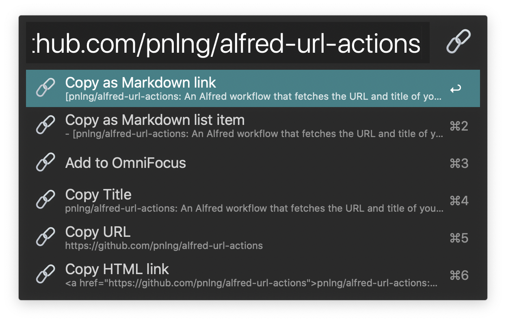
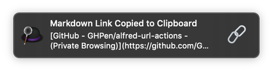
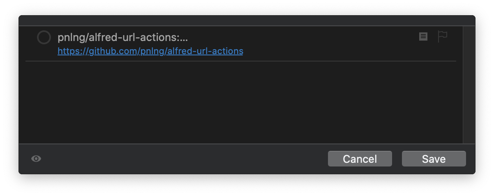

# URL Actions

URL Actions is an [Alfred](https://www.alfredapp.com/) workflow that fetches the URL and title of your browser's current tab (compatible with Firefox, Safari, Chrome, and pretty much everything else), and
does things with them. For example, it can

- Copy link in Markdown
- Add a task to OmniFocus Pro
- Clean up Amazon URLs

The actions are also customizable. It can

- Open custom URLs
- Copy custom strings to clipboard 

An optional [PopClip](https://pilotmoon.com/popclip/) extension is also available, if one is inclined to trigger the workflow from the mouse. 

## Download

- [Alfred Workflow](https://www.github.com/pnlng/alfred-url-actions/releases/latest/download/URL.Actions.alfredworkflow)
- [(Optional) PopClip Extension](https://www.github.com/pnlng/alfred-url-actions/releases/latest/download/URLtoAlfred.popclipextz)


<details>
<summary>Table of Contents</summary>

- [URL Actions](#url-actions)
  - [Download](#download)
  - [Screenshots](#screenshots)
  - [Why?](#why)
  - [Usage](#usage)
  - [Configuration](#configuration)
    - [Variables](#variables)
      - [Custom Actions](#custom-actions)
  - [Alternatives](#alternatives)
    - [Copying URLs](#copying-urls)
    - [Adding to OmniFocus](#adding-to-omnifocus)
    - [Browser Specific](#browser-specific)
  - [Acknowledgements](#acknowledgements)
</details>

## Screenshots

Alfred: 



macOS notification: 



OmniFocus quick entry: 




## Why?

I'd like to be able to select the URL in the address bar of my browser and save the URL together with the page title somewhere else -- without having to go back and forth between the browser and another app to copy and paste the two items separately. 

See the [Alternatives](#alternatives) section for other implementations. 

## Usage

Select the desired URL (<kbd>⌘L</kbd> to get the URL of the current tab in a browser). Fire up the workflow's associated hotkey, which is <kbd>⇧^C</kbd> by default. 

Alternatively, if you use [PopClip](https://pilotmoon.com/popclip/), you trigger Alfred through the PopClip extension. 

Note: The extension triggers Alfred 4 by default. If you use other versions of Alfred, you would need to modify `alfred.applescript` and `Bundle Identifier` in `Config.plist`, and [package](https://github.com/pilotmoon/PopClip-Extensions#anatomy-of-a-popclip-extension) the extension yourself. 

If you're in a non-browser app (as defined by the `BROWSERS` variable discussed in the [Variables](#Variables) section below), the workflow will supply an empty string in place of the title of the current webpage. 

## Configuration

### Variables

See [here](https://www.alfredapp.com/help/workflows/advanced/variables/#environment) for a quick tutorial on how to configure variables in Alfred.

- `CLEAN_AMAZON` - Default `true`
  - The workflow removes tracking tokens from Amazon URLs if this variable is set to `true`. 
  - To disable the feature, set the variable to `false`. 
- `BROWSERS` - Default `{"Firefox", "Safari", "Google Chrome", "Opera"}`
  - This helps the workflow determine whether to get the title of the window. If the frontmost app is not in the list, then the workflow will supply an empty string. 
  - Add your browser to this list if you use something else. 
- `CUSTOM_ACTIONS` - Default unspecified. 
  - You can supply custom actions that override the default actions. 

#### Custom Actions

For a template, see `default_actions.json`, accessible via the keyword `urlact` in Alfred. *But please do not edit the `default_actions.json` file, as user changes will be overridden when the workflow is updated.*

Example:

```
[
  {
    "action_title": "Copy as Markdown link",
    "output": "[{title}]({url})"
  },
  {
    "action_title": "Add to OmniFocus",
    "action_subtitle": "",
    "output": "omnifocus:///add?name={title}&note={url}",
    "encode": true
  }
]
```

Variables:

  - `{title}`
  - `{url}`

Attributes:

  - `action_title`: Action title shown in Alfred.
  - `action_subtitle`: (Optional) Action subtitle shown in Alfred. If unspecified, the workflow will display the formatted output in this field.
  - `output`: Desired output of the action. 
  - `encode`: (Optional) Default `false`. Whether to encode the title of the webpage. This is useful when the action is to open an URL scheme. 

*Note: Currently, if the output matches the regex `^.+:///.*`, the workflow will open the URL. Conversely, if the output doesn't match the regex, the workflow will copy the output to clipboard.*

## Alternatives

### Copying URLs

Fallroot's [Copy URL](https://github.com/fallroot/copy-url-for-alfred) is a great workflow for formatting an URL in various ways. It can get the current tab title and URL from Safari and Chrome. Alas, it does support Firefox. 

### Adding to OmniFocus

There is a workflow called [Create OmniFocus Tasks](https://web.archive.org/web/20170606130617/http://aaronhockley.com/alfred-2-workflow-create-omnifocus-tasks/) by Aaron Hockley. It's hosted [here on Dropbox](https://www.dropbox.com/s/nlx4uyfc905iyc2/CreateOmniFocusTasks.alfredworkflow), archived [here on GitHub](https://github.com/hzlzh/AlfredWorkflow.com/blob/master/Downloads/Workflows/CreateOmniFocusTasks.alfredworkflow), and is no longer actively maintained.

If you use only Safari or Chrome, and do not need to copy links in Markdown or clean Amazon URLs, this workflow might be the easiest way to add an URL and the associated page title to OmniFocus. 

### Browser Specific

There are a few browser specific tools that can send the frontmost web page and URL to OmniFocus. 

- [Firefox extension](https://addons.mozilla.org/en-US/firefox/addon/addtoomnifocus2/)
- [Script for Safari](https://github.com/jessesquires/safari-tabs-to-omnifocus)
- [Chrome extension](https://chrome.google.com/webstore/detail/send-to-omnifocus/ohdhaodomnlifoigpfcbjpcegdbefnen)

## Acknowledgements

This workflow is inspired by these articles and projects.

- [Clean Amazon links with TextExpander](https://leancrew.com/all-this/2015/06/clean-amazon-links-with-textexpander/) by Dr. Drang
- [Mail to OmniFocus - AppleScript](https://www.mnott.de/mail-to-omnifocus-applescript/) by Matthias Nott
- [Workflow/environment variables in Alfred](https://www.deanishe.net/post/2018/10/workflow/environment-variables-in-alfred/) by deanishe
- The [Copy URL](https://github.com/fallroot/copy-url-for-alfred) workflow by fallroot

This workflow is especially indebted to: 

- The [Alfred-Workflow](https://github.com/deanishe/alfred-workflow/) Python library by deanishe